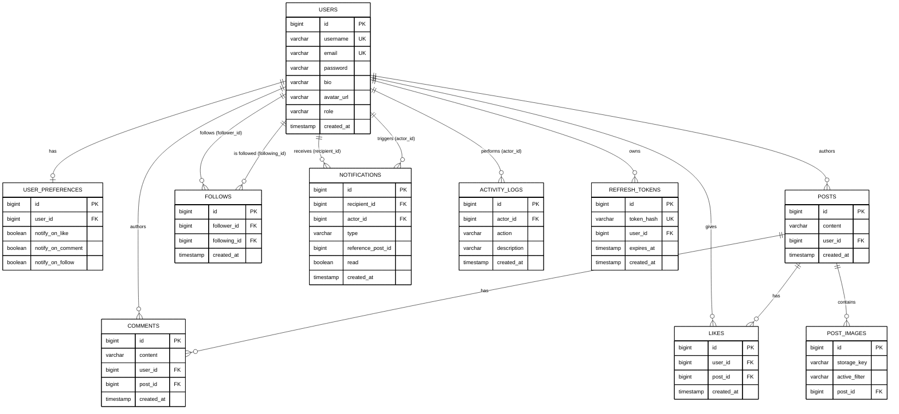

# Social Media Java App

## Database ERD

### Tables

#### users
| Column | Type | Constraints |
|---|---|---|
| id | BIGINT | PK |
| username | VARCHAR | NOT NULL, UNIQUE |
| email | VARCHAR | NOT NULL, UNIQUE |
| password | VARCHAR | NOT NULL |
| bio | VARCHAR | nullable |
| avatar_url | VARCHAR | nullable |
| role | VARCHAR(20) | NOT NULL, `USER` \| `ADMIN` |
| created_at | TIMESTAMP | NOT NULL |

#### user_preferences
| Column | Type | Constraints |
|---|---|---|
| id | BIGINT | PK |
| user_id | BIGINT | FK → users.id, NOT NULL, UNIQUE |
| notify_on_like | BOOLEAN | NOT NULL |
| notify_on_comment | BOOLEAN | NOT NULL |
| notify_on_follow | BOOLEAN | NOT NULL |

#### follows
| Column | Type | Constraints |
|---|---|---|
| id | BIGINT | PK |
| follower_id | BIGINT | FK → users.id, NOT NULL |
| following_id | BIGINT | FK → users.id, NOT NULL |
| created_at | TIMESTAMP | NOT NULL |

UNIQUE (follower_id, following_id)

#### posts
| Column | Type | Constraints |
|---|---|---|
| id | BIGINT | PK |
| content | VARCHAR(2000) | NOT NULL |
| user_id | BIGINT | FK → users.id, NOT NULL |
| created_at | TIMESTAMP | NOT NULL |

#### comments
| Column | Type | Constraints |
|---|---|---|
| id | BIGINT | PK |
| content | VARCHAR(500) | NOT NULL |
| user_id | BIGINT | FK → users.id, NOT NULL |
| post_id | BIGINT | FK → posts.id, NOT NULL |
| created_at | TIMESTAMP | NOT NULL |

#### likes
| Column | Type | Constraints |
|---|---|---|
| id | BIGINT | PK |
| user_id | BIGINT | FK → users.id, NOT NULL |
| post_id | BIGINT | FK → posts.id, NOT NULL |
| created_at | TIMESTAMP | NOT NULL |

UNIQUE (user_id, post_id)

#### post_images
| Column | Type | Constraints |
|---|---|---|
| id | BIGINT | PK |
| storage_key | VARCHAR | NOT NULL |
| active_filter | VARCHAR(20) | NOT NULL, `NONE` \| `BLACK_AND_WHITE` \| `CONTRAST` \| `SEPIA` \| `VINTAGE` |
| post_id | BIGINT | FK → posts.id, NOT NULL |

#### notifications
| Column | Type | Constraints |
|---|---|---|
| id | BIGINT | PK |
| recipient_id | BIGINT | FK → users.id, NOT NULL |
| actor_id | BIGINT | FK → users.id, NOT NULL |
| type | VARCHAR(20) | NOT NULL, `LIKE` \| `COMMENT` \| `FOLLOW` |
| reference_post_id | BIGINT | nullable |
| read | BOOLEAN | NOT NULL |
| created_at | TIMESTAMP | NOT NULL |

#### activity_logs
| Column | Type | Constraints |
|---|---|---|
| id | BIGINT | PK |
| actor_id | BIGINT | FK → users.id, NOT NULL |
| action | VARCHAR(30) | NOT NULL |
| description | VARCHAR(500) | NOT NULL |
| created_at | TIMESTAMP | NOT NULL |

`action` values: `USER_REGISTERED`, `USER_DELETED`, `EMAIL_CHANGED`, `PASSWORD_CHANGED`, `POST_CREATED`, `POST_UPDATED`, `POST_DELETED`, `COMMENT_CREATED`, `COMMENT_UPDATED`, `COMMENT_DELETED`, `LIKE_CREATED`, `LIKE_REMOVED`, `FOLLOW_CREATED`, `FOLLOW_REMOVED`, `POST_IMAGE_ADDED`, `POST_IMAGE_DELETED`

#### refresh_tokens
| Column | Type | Constraints |
|---|---|---|
| id | BIGINT | PK |
| token_hash | VARCHAR(64) | NOT NULL, UNIQUE |
| user_id | BIGINT | FK → users.id, NOT NULL |
| expires_at | TIMESTAMP | NOT NULL |
| created_at | TIMESTAMP | NOT NULL |

### Relationships

| From | Cardinality | To |
|---|---|---|
| users | 1 — 0..1 | user_preferences |
| users | 1 — 0..N | posts |
| users | 1 — 0..N | comments |
| users | 1 — 0..N | likes |
| users | 1 — 0..N | follows (follower_id) |
| users | 1 — 0..N | follows (following_id) |
| users | 1 — 0..N | notifications (recipient_id) |
| users | 1 — 0..N | notifications (actor_id) |
| users | 1 — 0..N | activity_logs |
| users | 1 — 0..N | refresh_tokens |
| posts | 1 — 0..N | comments |
| posts | 1 — 0..N | likes |
| posts | 1 — 0..N | post_images |
